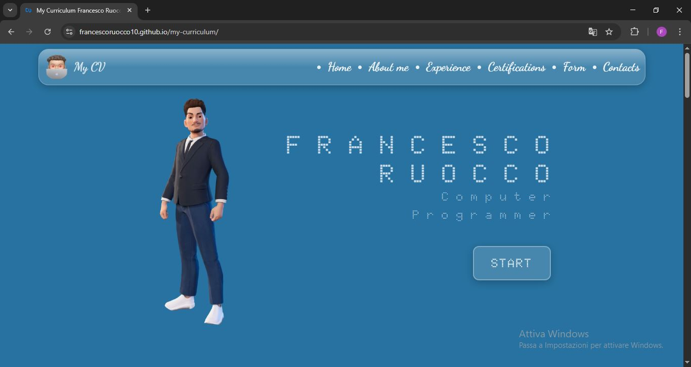

#  Curriculum Vitae Digitale - Sito Web Personale

## Descrizione
Questo sito rappresenta il mio curriculum vitae digitale. Contiene alcune informazioni personali, skill, certificazioni, esperienze lavorative, form e contatti. 

## Caratteristiche principali
- Sezioni ben organizzate: Home, About Me, Experience, Certifications, Form e Contacts
- Design responsivo, ottimizzato per dispositivi desktop e mobile
- Link ai miei profili social e portfolio
- Possibilità di contattarmi e ricevere il mio curriculum europeo in formato PDF

## Struttura del progetto
◻ `index.html`: file responsabile dell'inserimento della favicon, della definizione del titolo visualizzato nella scheda del browser e della configurazione dei font utilizzati nella pagina;

◻ `App.jsx`: importa e visulizza i principali componenti della pagina, strutturando l'intera applicazione;

◻ `AboutMe.jsx`: componente che mostra la sezione "AboutMe" con info personali, istruzioni e competenze visualizzate con immagini;

◻ `Certifications.jsx`: componente che mostra la sezione "Certifications", elencando tutte le certifizaioni ottenute sia durante il percorso scolastico che in ambiti esterni;

◻ `Contacts.jsx`: componente che mostra la sezione "Contacts", elenca i vari modi per contattarmi;

◻ `Experience.jsx`: componente che mostra la sezione "Experience", elenca l'esperienza lavorativa e professionale acquisita;

◻ `ImageSwiper.jsx`: componente che mostra la sezione "ImageSwiper", utilizza la libreria Swiper per creare un carosello di immagini con navigazione, paginazione cliccabile, autoplay e loop continuo. Mostra una serie di 31 immagini scorrevoli con uno spazio tra le slide e un bordo arrotondato;

◻ `Form.jsx`: componente che mostra la sezione "Form", permette agli utenti di contattarmi tramite l'invio di messaggio via email;

◻ `EmailConfig.js`: componente che gestisce il modulo di contatto, permettendo agli utenti di inviarmi messaggi tramite email;

◻ `UseEmailForm.jsx`: custom hook che gestisce lo stato e l'invio del modulo di contatto via email tramite EmailJS, includendo anche notifiche di successo o errore;

◻ `Home.jsx`: componente che mostra la sezione "Home" di benvenuto, include nome, avatar, professione e un pulsante di avvio per navigare nel sito;

◻ `Navbar.jsx`: componente che crea la barra di navigazione con link alle sezioni principali del sito e un logo/avatar;

◻ `HideOnScroll.jsx`: custom hook che gestice la visibilità di un elemento in base allo scroll della pagina, nascondendolo quando si scorre verso il basso e mostrandolo quando si scorre verso l'alto;

◻ `ScrollSpy.jsx`: componente che aggiorna dinamicamente l'URL in base alla sezione visibile durante lo scroll, facilitando la navigazione tra le sezioni della pagina;

## Tecnologie utilizzate
- JavaScript, CSS
- React
- Hosting su GitHub Pages, EmailJS
